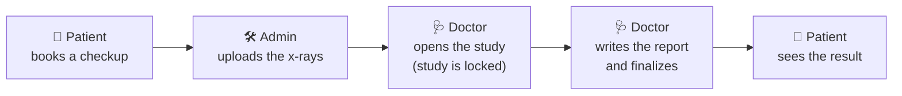
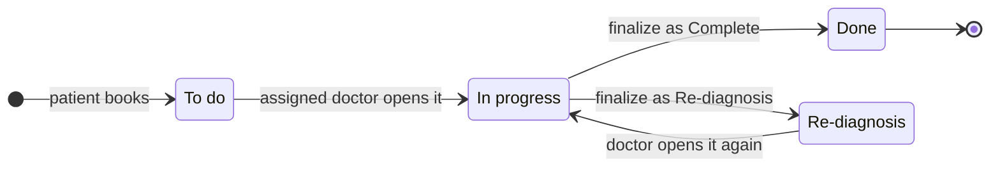
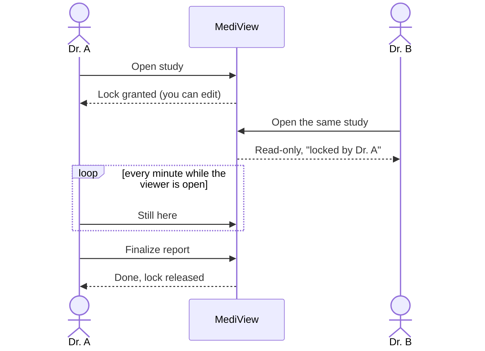
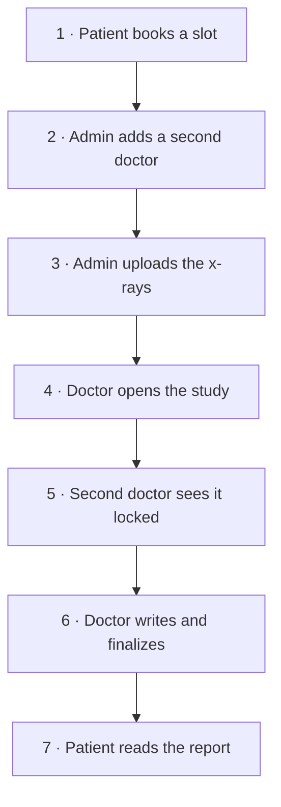

# MediView

MediView is a small radiology workflow. A patient books a checkup, the clinic uploads the x-rays,
a doctor reads them and writes a report, and the patient sees the result.

One rule shapes everything: **only one doctor can work on a study at a time.** While a doctor is
reading, everyone else sees the study as locked and read-only.

## How it works at a glance



Every booking creates a **study**: one patient, one doctor, one time slot, and the x-rays for it.

### Who does what

| Role | Can do |
| --- | --- |
| **Patient** | Register, book a slot with a doctor, follow their studies and read finalized reports |
| **Doctor** | See their worklist, open a study in the x-ray viewer, write findings, add medications, finalize |
| **Admin** | Add doctors and their weekly hours, upload x-rays to a study, override a status or free a stuck lock |

### The life of a study



- A study can only be opened **after its x-rays are uploaded**, and only by **the doctor it was
  booked with**.
- A finalized report is never edited. A re-diagnosis starts a new report, and the earlier one
  stays visible underneath it.
- Every status change is recorded with who made it and when. An admin can override a status, but
  must give a reason, and that reason is saved in the history.

### One doctor at a time: the study lock



- The lock is released when the doctor finalizes.
- If a doctor closes the tab without finalizing, the lock expires on its own **15 minutes** after
  the last "still here" signal.
- An admin can **force-release** a lock straight away, with a reason that goes into the study
  history.

## Run it locally

### 1. Install the prerequisites

- [.NET SDK 10](https://dotnet.microsoft.com/download) (10.0.100 or later)
- [Docker Desktop](https://www.docker.com/products/docker-desktop/), with Compose v2.20 or later
- Bash and `openssl` (built into macOS and Linux; use Git Bash or WSL on Windows)
- Chrome, Edge or Firefox (the x-ray viewer needs WebGL)

Run every command below from the repository root.

### 2. Configure, once

Each service needs a database connection string, and all four share one sign-in key. Both are
stored with .NET user-secrets, outside the repository:

```bash
for service in Identity Studies Imaging Reporting; do
  lower=$(echo "$service" | tr '[:upper:]' '[:lower:]')
  dotnet user-secrets set "ConnectionStrings:Postgres" \
    "Host=localhost;Port=15432;Database=mediview_$lower;Username=mediview;Password=mediview" \
    --project "src/Services/$service/MediView.$service.Api"
done

key=$(openssl rand -base64 48)
for service in Identity Studies Imaging Reporting; do
  dotnet user-secrets set "Jwt:SigningKey" "$key" \
    --project "src/Services/$service/MediView.$service.Api"
done
```

### 3. Start everything

```bash
./run.sh
```

This starts the database, Redis and the log viewer in Docker, builds the solution, creates the
databases, loads the demo accounts, and starts the app. Wait until the output stops scrolling,
then open:

**<http://localhost:5217>**

Press **Ctrl+C** in the same terminal to stop. Your data is kept for next time.

### 4. Sign in with a demo account

The first start creates three accounts. They all use the password **`MediView#2026`**.

| Role | Email | Name |
| --- | --- | --- |
| Admin | `admin@mediview.local` | Ada Admin |
| Doctor | `doctor@mediview.local` | Dan Doctor |
| Patient | `patient@mediview.local` | Pat Patient |

Dan Doctor works **Monday to Friday, 08:00-16:00**, in 30-minute slots.

Sample x-rays are in [samples/chest-phantom/](samples/chest-phantom/): 12 slices of a synthetic
chest scan, with no real patient data.

### 5. Or register a new patient

On the sign-in page choose **Create a patient account**, then enter a full name, email and password
(twice). New sign-ups are always patients. Doctors are added by an admin on the **Doctors** page.

> **Tip:** each browser tab keeps its own sign-in, so you can be the patient in one tab and the
> doctor in another. In the same tab, sign out from the sidebar before you switch role.

## Demo: the full flow in about 15 minutes



1. **Patient books.** Sign in as `patient@mediview.local`. Open **Book a checkup**, choose
   *Dan Doctor*, choose a free slot and click **Confirm booking**. **My studies** now shows the
   study as *To do*.
2. **Admin adds a second doctor.** Sign out and sign in as `admin@mediview.local`. On **Doctors**,
   create *Dr. B* (`dr.b@mediview.local`, password `MediView#2026`, any licence and specialty).
   You need a second doctor for step 5.
3. **Admin uploads the x-rays.** Open **Import x-rays**, click **Select** next to the patient's
   study, drop in the 12 files from `samples/chest-phantom/` and click **Import x-rays**. The
   study shows *Imported* and is still *To do*.
4. **Doctor opens the study.** In a new tab, sign in as `doctor@mediview.local` and click
   **Open** on the study in the worklist. The status changes to *In progress* and the lock badge
   says *You*. Scroll to move through the slices, drag to change brightness and contrast, and try
   Pan, Zoom and Reset.
5. **Second doctor sees the lock.** Copy the viewer's address. In another tab, sign in as
   `dr.b@mediview.local` and paste it. Dr. B sees the same images under a red **READ-ONLY**
   banner that names Dan Doctor, and no report editor.
6. **Doctor finalizes.** Back as Dan Doctor, type findings and an impression (each saves when you
   leave the field), add a medication, leave **Complete** selected and click
   **Finalize & release lock**. The study is *Done* and the lock is free.
7. **Patient reads the result.** As the patient, refresh **My studies**. The study is *Done*,
   with its timeline and the finalized report and medications.

Two optional extras:

- **Re-diagnosis.** In step 6, choose **Re-diagnosis** instead of Complete. The study moves to
  *Re-diagnosis*. When the doctor opens it again, a new draft starts and the first report stays
  underneath it.
- **Admin override.** As the admin, open **Import x-rays** and click the study number. The page
  lists every status change and who made it. Enter a reason, then click **Override status** or
  **Force release lock**. Both buttons refuse an empty reason.

## If something goes wrong

| What you see | What to do |
| --- | --- |
| A service stops with `Connection string 'Postgres' is not configured` or `Jwt:SigningKey must be at least 32 bytes` | Run the commands in [step 2](#2-configure-once). |
| Docker says a port is already allocated | Change `POSTGRES_PORT`, `REDIS_PORT` or `SEQ_PORT` in `.env`. If you change the Postgres port, use the new port in the step 2 connection strings. |
| `address already in use` on port 5217 or 5062 | Another copy of MediView is still running. Press Ctrl+C in its terminal. |
| Booking shows no free slots | Dan Doctor only works Monday to Friday, 08:00-16:00. Click **Later** to see the following days. |
| A study is still locked after the doctor closed the tab | The lock expires 15 minutes after the doctor's last activity, or an admin can use **Force release lock**. |
| You want to start over with fresh demo data | Run `docker compose down -v && rm -rf .data`, then `./run.sh`. |
